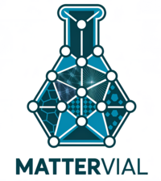

<div align="center" style="margin:0">
<a target="_blank" rel="noopener noreferrer" href="img/MATTERVial_logo.png">
        
      </a>
<h3>Materials Feature Extraction via Interpretable Artificial Learning</h3>
</div>


## Overview

MatterVial is a featurizer tool designed for materials science, leveraging both graph-neural networks (GNNs) and traditional feature engineering to extract valuable chemical information from materials structures and compositions. It aims to enhance the performance of materials property prediction models by generating meaningful features for a variety of machine learning tasks. MatterVial stands for **MAT**erials fea**T**u**R**e **E**xtraction **V**ia **I**nterpretable **A**rtificial **L**earning, evoking the metaphor of a vial containing distilled knowledge from materials data, representing our tool's ability to extract and contain valuable materials insights.


## Available Featurizers

MatterVial offers a diverse set of feature extraction tools, each designed to capture different aspects of materials' chemical and structural information:

### Graph Neural Network (GNN) Featurizers

-   **DescriptorMEGNetFeaturizer**: Unified descriptor-oriented MEGNet featurizer as described in the methods section. Provides a single interface for retrieving encoded features from pretrained MEGNet models:
    - `base_descriptor='l-MM_v1'` (default): Extracts 758 ℓ-MM (latent MatMiner) features
    - `base_descriptor='l-OFM_v1'`: Extracts 188 ℓ-OFM (latent Orbital Field Matrix) features

-   **AdjacentGNNFeaturizer**: Implements the Adjacent GNN featurizer described in the methods section. Trains task-specific GNN models on-the-fly using the user's dataset for each fold of the train-test split:
    - `base_model='MEGNet'` (default): Uses MEGNet architecture
    - `base_model='coGN'`: Uses coGN architecture (coming soon)

-   **MVLFeaturizer**: Extracts features from pretrained MEGNet models provided by the Materials Virtual Lab, trained on diverse Materials Project datasets. These models cover formation energy, Fermi energy, elastic constants (KVRH and GVRH), and band gap properties. Users can select different intermediate layers (16-neuron or 32-neuron) from the regression head of the MEGNet models, or combine features from multiple layers.

-   **ORBFeaturizer**: Extracts features using the ORB-v3 machine learning interatomic potential (MLIP). ORB models provide high-quality structural embeddings based on orbital-based representations and require a specialized conda environment.

#### Legacy Featurizers (Deprecated)

-   **LatentMMFeaturizer (ℓ-MM)**: ⚠️ **Deprecated** - Use `DescriptorMEGNetFeaturizer(base_descriptor='l-MM_v1')` instead. This featurizer extracts latent space features from MatMiner descriptors using a pretrained MEGNet model.

-   **LatentOFMFeaturizer (ℓ-OFM)**: ⚠️ **Deprecated** - Use `DescriptorMEGNetFeaturizer(base_descriptor='l-OFM_v1')` instead. This featurizer extracts latent space features from Orbital Field Matrix (OFM) descriptors.

-   **AdjacentMEGNetFeaturizer**: ⚠️ **Deprecated** - Use `AdjacentGNNFeaturizer(base_model='MEGNet')` instead. This featurizer trains a MEGNet model on-the-fly using the user's dataset.

### Composition-Based Featurizers
-   **RoostModelFeaturizer**: Featurizer for ROOST (Representation Learning from Stoichiometry) models, which extract features directly from material compositions without requiring structural information. Available pretrained models:
    - `roost_mpgap`: ROOST model pretrained on the Materials Project band gap dataset
    - `roost_oqmd_eform`: ROOST model pretrained on the OQMD formation energy dataset

### SISSO-based Feature Augmentation
-   **SISSO Formula Featurizer**: Implements the SISSO-based formula featurizer described in the methods section. This applies symbolic expressions generated by the SISSO++ framework to create new features from existing MatMiner descriptors. The method uses mathematical operators (addition, subtraction, multiplication, division, sine, cosine, exponential, logarithm) to generate interpretable feature combinations across 15 different datasets, providing 20 paired-feature formulas per dataset.

## Feature Interpretation

MatterVial provides comprehensive interpretability tools to understand the extracted features:

-   **Interpreter**: The main interpretability class that bridges the gap between high-level latent representations and interpretable chemical descriptors. It uses surrogate XGBoost models trained on the MP2018-stable dataset to predict each latent feature based on interpretable MatMiner and OFM features.

-   **SHAP Analysis**: For each feature, the top 30 most influential interpretable descriptors are identified using SHAP values, providing insights into which chemical properties drive the latent representations.

-   **Symbolic Regression**: The SHAP-identified features are forwarded to SISSO++ for symbolic regression, retrieving symbolic formulas that correlate with latent features and provide chemical interpretability.

-   **Visualization**: SVG plots and decomposition visualizations help users understand feature importance and chemical relationships.

## Installation

To install MatterVial, clone the repository and use the following command:

```bash
pip install -r requirements.txt
```

Ensure you have all the necessary dependencies installed, including TensorFlow, scikit-learn, the MEGNet library and Pytorch.

## Usage

### Basic Examples

#### MEGNet Featurizers
Here's an example of how to use MatterVial to extract features from a list of structures:

```python
import pandas as pd
from mattervial import (MVLFeaturizer, AdjacentGNNFeaturizer, DescriptorMEGNetFeaturizer, ORBFeaturizer)

# Initialize featurizers using new unified classes
mvl32 = MVLFeaturizer(layers='layer32')  # Single layer
mvl16 = MVLFeaturizer(layers='layer16')  # Single layer
mvl_all = MVLFeaturizer()  # Both layers (default)

# Initialize descriptor-oriented MEGNet featurizer (new unified approach)
desc_mm = DescriptorMEGNetFeaturizer(base_descriptor='l-MM_v1')  # ℓ-MM featurizer
desc_ofm = DescriptorMEGNetFeaturizer(base_descriptor='l-OFM_v1')  # ℓ-OFM featurizer

# Initialize adjacent GNN featurizer (new unified approach)
adj_gnn = AdjacentGNNFeaturizer(base_model='MEGNet', layers='layer32')

# Initialize ORB featurizer
orb_featurizer = ORBFeaturizer(model_name="ORB_v3")

# Example structures
structures = pd.Series([structure1, structure2, structure3])  # pymatgen Structure objects

# Extract features using MVLFeaturizer
features_32 = mvl32.get_features(structures)  # 160 features from layer32
features_16 = mvl16.get_features(structures)  # 80 features from layer16
features_combined = mvl_all.get_features(structures)  # 240 features (160+80)

# Extract descriptor-oriented MEGNet features (ℓ-MM and ℓ-OFM)
l_mm_features = desc_mm.get_features(structures)  # 758 ℓ-MM features
l_ofm_features = desc_ofm.get_features(structures)  # 188 ℓ-OFM features

# Extract ORB features (requires ORB environment)
orb_features = orb_featurizer.get_features(structures)

# Train the AdjacentGNNFeaturizer on the fly
targets = [1.2, 2.3, 0.8]  # Target property values
adj_gnn.train_adjacent_model(structures, targets=targets, adjacent_model_path='./models/')

# Extract features using the trained AdjacentGNNFeaturizer
features_adj = adj_gnn.get_features(structures)

# Legacy usage (deprecated but still works with warnings)
# from mattervial import LatentMMFeaturizer, LatentOFMFeaturizer, AdjacentMEGNetFeaturizer
# l_mm_legacy = LatentMMFeaturizer()  # Issues deprecation warning
# l_ofm_legacy = LatentOFMFeaturizer()  # Issues deprecation warning
# adj_legacy = AdjacentMEGNetFeaturizer(layers='layer32')  # Issues deprecation warning
```

#### ROOST Featurizers
Here's an example of how to use MatterVial to extract features from a list of compositions:

```python
import pandas as pd
from mattervial import RoostModelFeaturizer

# Initialize ROOST featurizers
roost_mpgap = RoostModelFeaturizer(model_type='mpgap')
roost_oqmd_eform = RoostModelFeaturizer(model_type='oqmd_eform')

# Example compositions
compositions = pd.Series(["Fe2O3", "Al2O3"])

# Extract features using roost_mpgap
features_mpgap = roost_mpgap.get_features(compositions)

# Extract features using roost_oqmd_eform
features_oqmd_eform = roost_oqmd_eform.get_features(compositions)
```

#### SISSO Featurization

Here's an example of how to use MatterVial to extract features with SISSO:

```python
from mattervial.featurizers import get_sisso_features
# Assuming 'dataset_MatMinerFeaturized.csv' contains your initial featurized data
# and has a 'target' column and other feature columns.
sisso_features_df = get_sisso_features(input_csv_path="dataset_MatMinerFeaturized.csv", type="SISSO_FORMULAS_v1")

# Now 'sisso_features_df' contains only the newly generated SISSO_ features.
# You can merge this DataFrame with your original data if needed.
```

#### Feature Interpretation

Here's an example of how to use MatterVial's interpretability tools:

```python
from mattervial.interpreter import Interpreter
import json

# Initialize the interpreter
interpreter = Interpreter()

# Get formula for a latent feature (ℓ-OFM or ℓ-MM)
formula_info = interpreter.get_formula("l-OFM_v1_1")
print("Formula information:")
print(json.dumps(formula_info, indent=2))

# Get SHAP values for feature importance analysis
shap_data = interpreter.get_shap_values("MEGNet_MatMiner_1")
print("\nSHAP analysis:")
print(json.dumps(shap_data, indent=2))

# Get SISSO formula interpretation
sisso_formula = interpreter.get_formula("SISSO_matbench_dielectric_1")
print("\nSISSO formula:")
print(json.dumps(sisso_formula, indent=2))

# Display SVG visualization (if available)
try:
    interpreter.display_svg("MEGNet_MatMiner_1", plot_type="shap_summary")
except Exception as e:
    print(f"Visualization not available: {e}")
```

## ⚙️ Environment Setup

MatterVial utilizes specialized models for certain featurizers, some of which have unique and conflicting dependencies. To manage this, we provide specific Conda environment files in the `envs/` folder. Please install the environment that corresponds to the features you intend to use.

### Primary Environment

This environment supports the main featurizers used in our paper, including **MEGNet-based models** (MVL featurizers, descriptor-oriented l-MM and l-OFM, and adjacent MEGNet), and **ROOST**. 

**1. Create the environment:**

```bash
conda env create -f envs/env_primary.yml
```

**2. Activate the environment:**

```bash
conda activate env_primary
```

-----

### ORB Environment

This is a specialized environment required **only** for using the **ORB-v3** MLIP-based featurizer.

**1. Create the environment:**

```bash
conda env create -f envs/env_orb.yml
```

**2. Activate the environment:**

```bash
conda activate env_orb
```

-----

### KGCNN Environment

This environment is required **only** for using featurizers based on **coGN** or **coGNN** models.

**1. Create the environment:**

```bash
conda env create -f envs/env_kgcnn.yml
```

**2. Activate the environment:**

```bash
conda activate env_kgcnn
```

## Contributions

We welcome contributions to improve the MatterVial tool, including adding more pretrained models, enhancing the featurization techniques, or improving the feature interpretation capabilities. Please feel free to submit pull requests or create issues for discussion.

## License

This project is licensed under the MIT License.

## Acknowledgments

The MatterVial tool is built on top of other software packages and publicly available GNN models such as MEGNet, ROOST, ORB-v3 and coGN. We also acknowledge the developers of the SISSO package which was used to augment MatMiner featurizers via symbolic regression and decompose the feature-space of GNN models.
