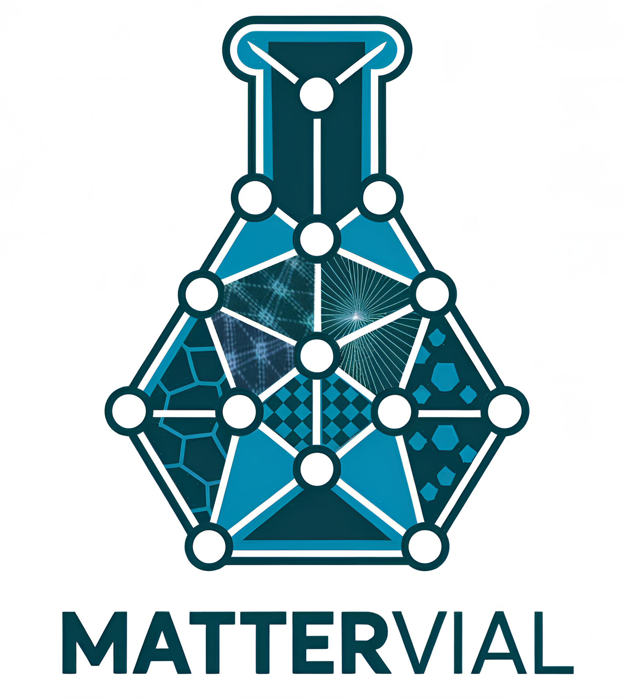

MatterVial Documentation
========================

**Materials Feature Extraction via Interpretable Artificial Learning**

MatterVial is a comprehensive featurizer tool designed for materials science, leveraging both graph neural networks (GNNs) and traditional feature engineering to extract valuable chemical information from materials structures and compositions. It aims to enhance the performance of materials property prediction models by generating meaningful features for a variety of machine learning tasks.

.. toctree::
   :maxdepth: 2
   :caption: Contents:

   installation
   quickstart
   api/index
   examples/index
   interpretation
   environments
   contributing

Overview
--------

MatterVial stands for **MAT**\ erials fea\ **T**\ u\ **R**\ e **E**\ xtraction **V**\ ia **I**\ nterpretable **A**\ rtificial **L**\ earning, evoking the metaphor of a vial containing distilled knowledge from materials data, representing our tool's ability to extract and contain valuable materials insights.

Key Features
------------

* **Multiple Featurization Approaches**: Structure-based, composition-based, and symbolic regression methods
* **Pretrained Models**: Access to Materials Virtual Lab MEGNet models and ROOST composition models
* **Task-Specific Training**: Adjacent GNN models that train on your specific dataset
* **Latent Space Features**: Compressed representations of MatMiner and OFM descriptors
* **Interpretability Tools**: SHAP analysis and symbolic regression for understanding features
* **Flexible Architecture**: Modular design allowing easy integration of new models
* **Environment Management**: Specialized conda environments for different model types

Featurizer Types
----------------

Graph Neural Network (GNN) Featurizers
~~~~~~~~~~~~~~~~~~~~~~~~~~~~~~~~~~~~~~~

* **MVLFeaturizer**: Pretrained Materials Virtual Lab MEGNet models
* **LatentMMFeaturizer (ℓ-MM)**: Latent space MatMiner features (758 features)
* **LatentOFMFeaturizer (ℓ-OFM)**: Latent space Orbital Field Matrix features (188 features)
* **AdjacentMEGNetFeaturizer**: Task-specific MEGNet models trained on-the-fly
* **ORBFeaturizer**: ORB-v3 machine learning interatomic potential features

Composition-Based Featurizers
~~~~~~~~~~~~~~~~~~~~~~~~~~~~~

* **RoostModelFeaturizer**: ROOST models for composition-only featurization

Symbolic Regression Features
~~~~~~~~~~~~~~~~~~~~~~~~~~~~

* **SISSO Formula Featurizer**: Mathematical combinations of existing features using SISSO++ framework

Interpretability Tools
~~~~~~~~~~~~~~~~~~~~~~

* **Interpreter**: Main interpretability class for understanding latent features
* **SHAP Analysis**: Feature importance analysis using SHAP values
* **Symbolic Regression**: SISSO++ formulas for chemical interpretability
* **Visualization**: SVG plots and feature decomposition tools

Quick Start
-----------

.. code-block:: python

   import pandas as pd
   from mattervial import MVLFeaturizer, LatentMMFeaturizer

   # Initialize featurizers
   mvl_featurizer = MVLFeaturizer()  # Uses both layer32 and layer16
   l_mm_featurizer = LatentMMFeaturizer()  # ℓ-MM featurizer

   # Extract features from structures
   structures = pd.Series([structure1, structure2, structure3])
   mvl_features = mvl_featurizer.get_features(structures)  # 240 features
   l_mm_features = l_mm_featurizer.get_features(structures)  # 758 features

   # Interpret features
   from mattervial.interpreter import Interpreter
   interpreter = Interpreter()
   formula_info = interpreter.get_formula("l-MM_v1_1")

Installation
------------

MatterVial requires different conda environments for different featurizers:

.. code-block:: bash

   # Primary environment (MEGNet, ROOST)
   conda env create -f envs/env_primary.yml
   conda activate env_primary

   # ORB environment (ORB featurizer only)
   conda env create -f envs/env_orb.yml
   conda activate env_orb

   # KGCNN environment (coGN models)
   conda env create -f envs/env_kgcnn.yml
   conda activate env_kgcnn

Citation
--------

If you use MatterVial in your research, please cite our paper:

.. code-block:: bibtex

   @article{mattervial2024,
     title={MatterVial: Materials Feature Extraction via Interpretable Artificial Learning},
     author={Author Names},
     journal={Journal Name},
     year={2024},
     doi={DOI}
   }

License
-------

This project is licensed under the MIT License - see the LICENSE file for details.

Indices and tables
==================

* :ref:`genindex`
* :ref:`modindex`
* :ref:`search`
